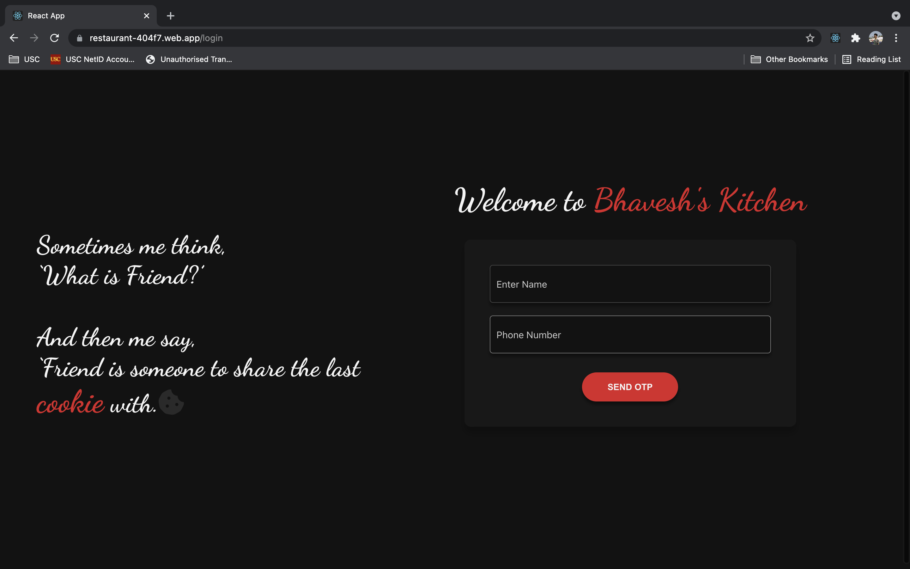
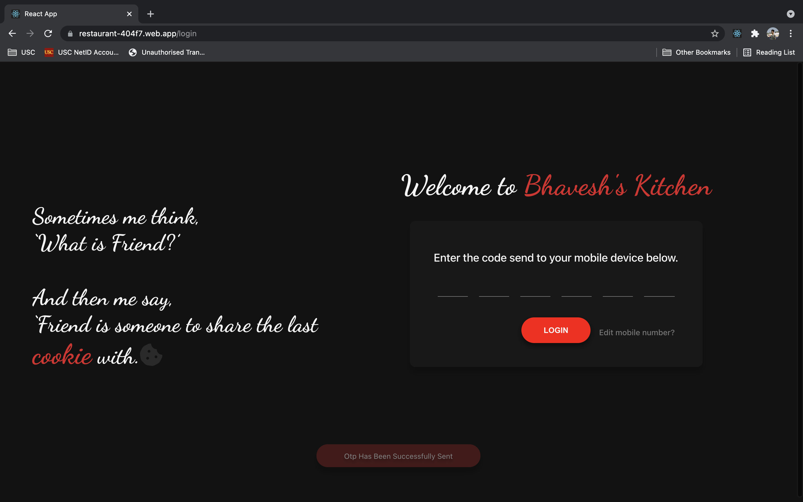
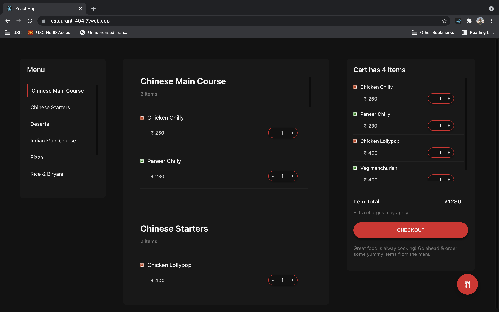
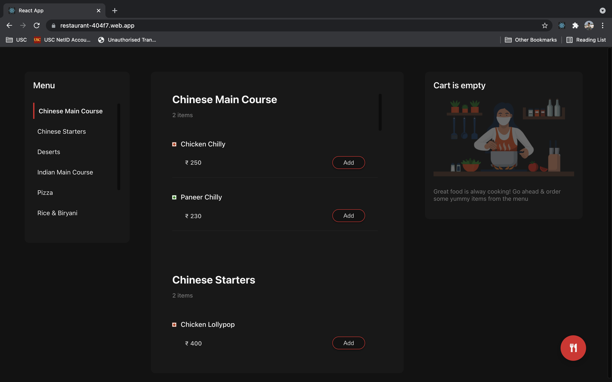
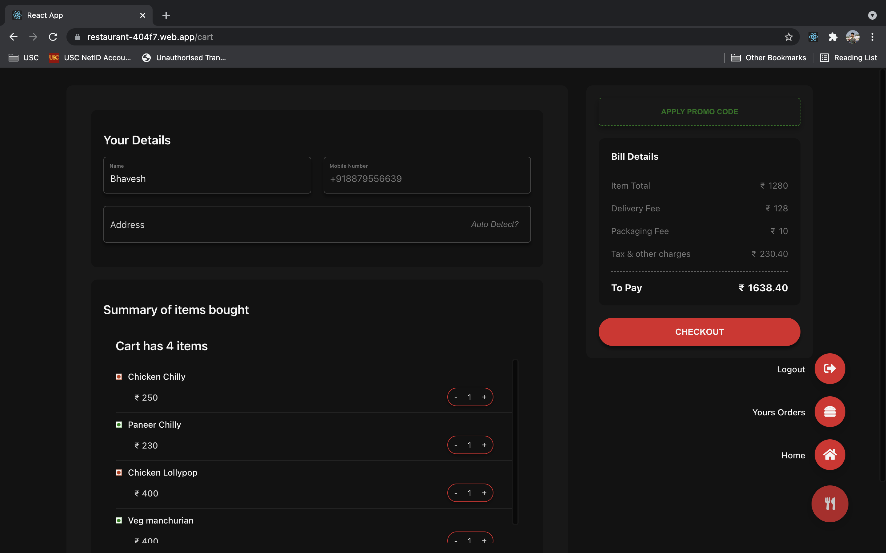
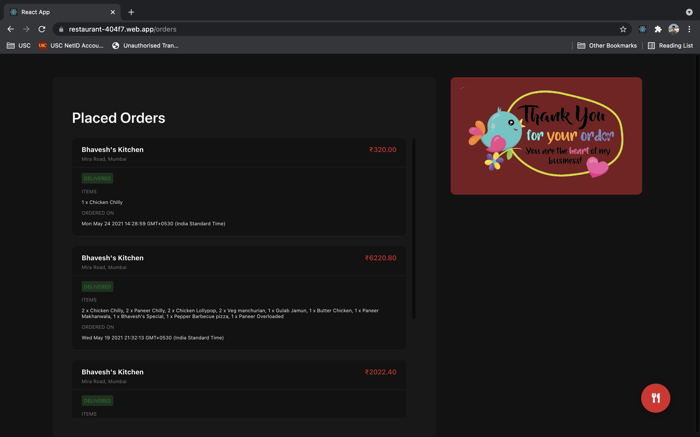

# Bhavesh Kitchen

### About

Bhavesh Kitchen is a React.js Web Application for ordering meals from a restaurant created for the sole purpose of learning.

#### [View the application live](https://restaurant-404f7.web.app/login)

### Technology Stack

1. Web Frontend developed using React.js

2. Backend developed using Firebase

3. User registration with Firebase OTP Authenication

4. Data stored in Firebase

### Features

#### User

- Simple OTP Authenication.
- Add delicious items to the cart.
- Checkout by applying promocode.
- View all past orders.
- User Friendly Interface.
- Auto deteect location with Google Location Api.

## React Screenshots

### Login

### Dashboard

### Checkout

### Past Orders

